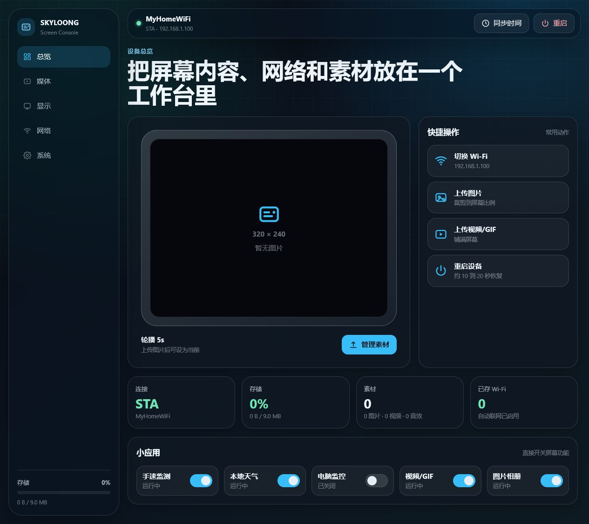
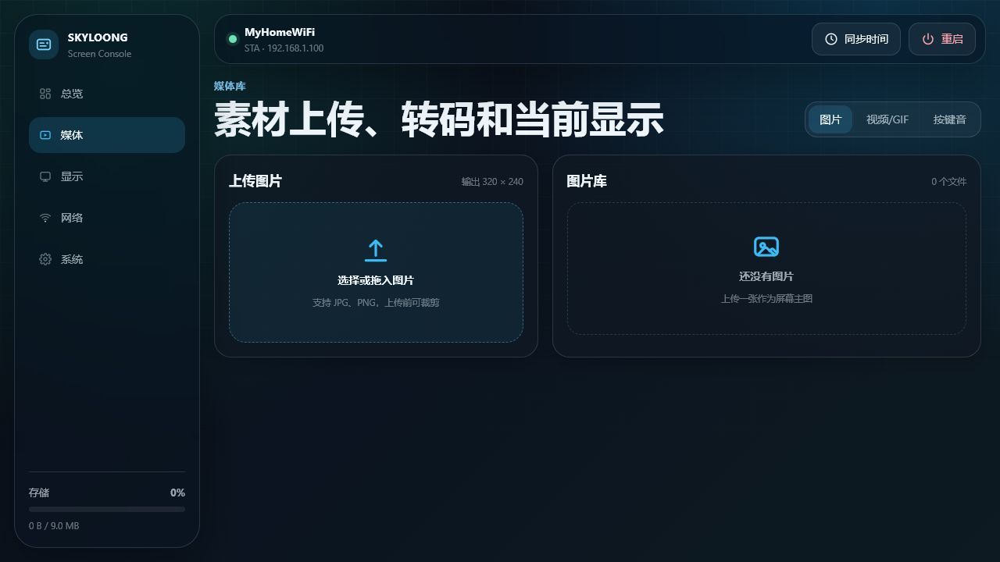
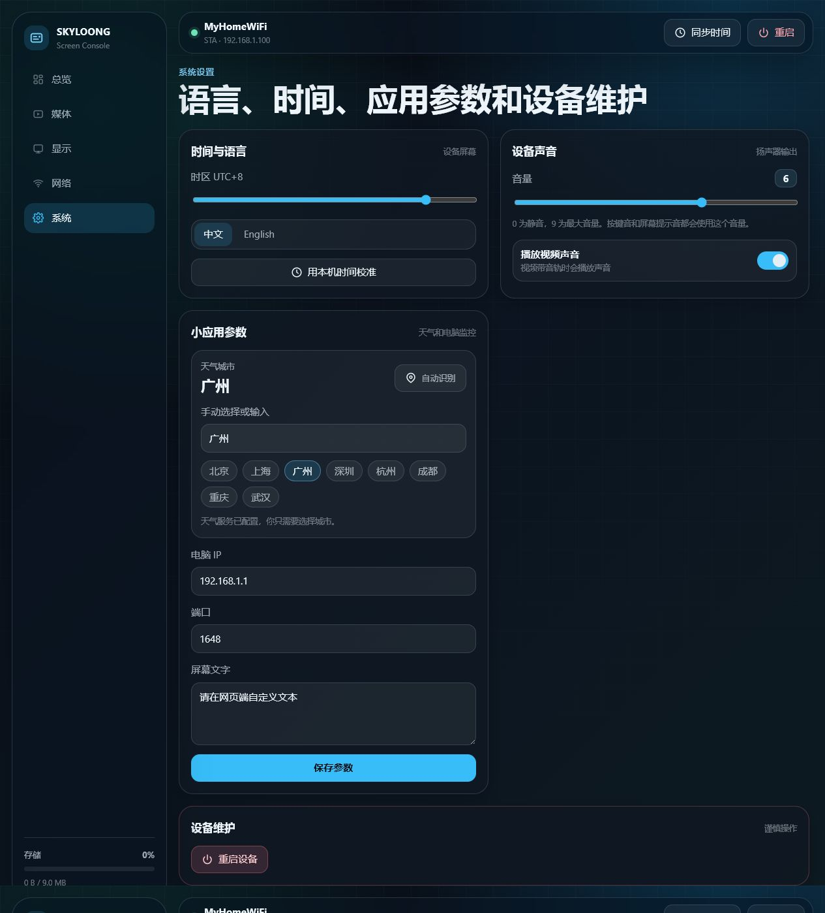

# SKYLOONG 屏幕模块固件

这是基于 ESP32-S3 和 ESP-IDF 5.1.4 的 SKYLOONG 键盘屏幕模块固件。

这个分支重点优化日常使用体验：新的现代化网页管理台、更方便的 Wi-Fi
配置、图片/视频/GIF/按键音上传、屏幕音量控制、天气城市设置，以及更适合
320 x 240 小屏幕的视频上传转码策略。



## 主要功能

- 通过浏览器管理 SKYLOONG/GK87 风格的 320 x 240 键盘屏幕。
- 上传图片、GIF、视频和自定义按键音。
- 设置视频显示方式：完整显示补黑边，或铺满屏幕并裁切边缘。
- 在管理台里控制设备音量和视频是否播放声音。
- 在浏览器里配置 Wi-Fi，并保存多个网络用于自动重连。
- 设置天气城市，同时不在网页里展示天气 API Key，避免误操作。
- 开关时间、天气、电脑监控、APS、图片、视频等屏幕应用。
- 使用 ESP-IDF v5.1.4 构建和刷写 ESP32-S3 固件。

## 管理台展示

内置网页管理台适配桌面和手机屏幕。界面采用深色毛玻璃风格，包含状态卡片、
快捷操作、媒体管理、显示设置、网络配置和系统设置等页面。

### 总览页


总览页展示设备状态、当前 IP、存储空间、已保存 Wi-Fi 数量，以及常用功能入口。

### 媒体页



媒体页支持图片上传、视频/GIF 上传、按键音上传和文件删除。MP4 和 GIF 会先在
浏览器里转码，再上传到屏幕：

- 输出画布：`320 x 240`，匹配屏幕物理分辨率。
- 帧率：MPEG1 兼容的 `24 FPS`。
- 视频：低码率 MPEG1，并关闭 B 帧，减轻 ESP32-S3 解码压力。
- 音频：可选 MP2 单声道音轨；关闭视频声音时会完全移除音轨。
- 铺满屏幕：画面会占满整块屏幕，但必要时会裁切边缘。
- 完整显示：保留完整画面，比例不一致时会补黑边。

想要尽量流畅播放时，建议先关闭“播放视频声音”，再上传大视频或 4K 原片。
已经上传到屏幕里的旧视频不会自动变成新参数，需要重新上传原始视频文件。

### 系统页



系统页可以设置音量、视频声音、时区、语言、天气城市、电脑监控目标和设备重启。

## 刷固件教程

### 准备工作

- SKYLOONG/GK87 ESP32-S3 屏幕模块。
- USB 数据线，不能只用充电线。
- 推荐使用 Windows。
- 安装 ESP-IDF v5.1.4，默认路径为 `%USERPROFILE%\esp\esp-idf`。
- 安装 ESP-IDF 工具链，默认路径为 `%USERPROFILE%\.espressif`。
- 安装 Git。

屏幕通常会识别为 Espressif USB 串口/JTAG 设备：

```text
USB VID:PID=303A:1001
USB 串行设备 (COM3)
```

你的电脑上端口号可能不是 `COM3`，以实际扫描结果为准。

### 编译固件

打开 ESP-IDF 终端，或者在命令行里先加载 ESP-IDF 环境：

```bat
cd path\to\SKYLOONG
call "%USERPROFILE%\esp\esp-idf\export.bat"
idf.py build
```

如果 Windows 路径里包含中文或路径很长，建议复制到短路径再编译，例如 `C:\s`：

```powershell
robocopy "C:\path\to\SKYLOONG" C:\s /MIR /XD .git build managed_components web_new\__pycache__ web_new\_mockfs
cd C:\s
cmd /d /c 'call "%USERPROFILE%\esp\esp-idf\export.bat" && idf.py build'
```

### 刷入固件

先查看屏幕端口：

```bat
python -m serial.tools.list_ports -v
```

确认端口后刷入：

```bat
idf.py -p COM3 flash
```

请把 `COM3` 换成你的实际端口。成功刷入时，日志末尾会看到类似内容：

```text
Hash of data verified.
Leaving...
Hard resetting via RTS pin...
Done
```

### 常见刷机问题

- 如果只看到 `COM1`，说明屏幕没有以可刷写的 ESP32-S3 串口设备出现。
  可以重新插拔 USB，或让屏幕进入下载模式后再试。
- 一定要使用 USB 数据线，充电线可能无法识别串口。
- 如果一直卡在连接阶段，可以按住模块上的 BOOT/下载按键再执行刷机命令。
- 不要刷到不确定的端口，端口应能对应到 `VID_303A:1001` 或 Espressif 设备。

## 管理台开发

可编辑的网页源码在：

```text
web_new/
```

固件实际嵌入的网页文件在：

```text
web/
main/include/webserver/
```

修改 `web_new` 后，先同步到 `web`，再重新生成嵌入头文件：

```powershell
Copy-Item -Force web_new\index.js web\index.js
Copy-Item -Force web_new\index.css web\index.css
Copy-Item -Force web_new\index.html web\index.html
& 'C:\Program Files\Git\bin\bash.exe' updateWeb.sh
```

然后重新编译并刷入：

```bat
idf.py build
idf.py -p COM3 flash
```

## 验证命令

`tools/` 目录里放了这个分支使用的轻量检查脚本：

```powershell
node --check web_new\index.js
node --check web\index.js
powershell -NoProfile -ExecutionPolicy Bypass -File tools\verify_web_video_transcode.ps1
powershell -NoProfile -ExecutionPolicy Bypass -File tools\verify_web_dirty_state.ps1
powershell -NoProfile -ExecutionPolicy Bypass -File tools\verify_video_pipeline.ps1
powershell -NoProfile -ExecutionPolicy Bypass -File tools\verify_wifi_pipeline.ps1
```

发布或刷机前建议至少再跑一次完整构建：

```bat
idf.py build
```

## 目录结构

```text
main/                    ESP32-S3 固件源码
main/include/webserver/  自动生成的嵌入网页资源
web/                     会被打进固件的网页资源
web_new/                 可编辑的新版网页管理台
components/              ESP-IDF、Arduino、LVGL、TFT、音频等依赖组件
tools/                   源码检查脚本
docs/images/             README 展示截图
```

## 开源协议

本仓库内的项目代码和本地修改使用 0BSD 协议发布，详见 [LICENSE](LICENSE)。

第三方组件和内置依赖仍保留它们自己的原始协议，请查看对应组件目录里的许可证文件。
